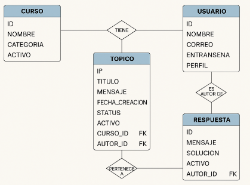

# ForoHub - API RESTful para un foro de discusión

## Descripción

ForoHub es una aplicación backend desarrollada con Spring Boot que permite gestionar un foro de discusión con cursos, tópicos, usuarios y respuestas.  
Permite registrar, listar, actualizar y eliminar tópicos, así como gestionar usuarios, cursos y respuestas relacionadas.

---

## Tecnologías usadas

- Java 21
- Spring Boot 3
- Spring Data JPA
- Hibernate
- PostgreSQL
- Maven
- Insomnia / Postman (para pruebas de API)

---

## Instrucciones para correr el proyecto

1. Clonar el repositorio:
   ```bash
   git clone https://github.com/tuusuario/foro_hub.git
   cd foro_hub
2. Configurar la conexión a la base de datos en src/main/resources/application.properties

3. Ejecutar la aplicación:
   ./mvnw spring-boot:run

4. Usar Insomnia o Postman para probar los endpoints REST disponibles.

## Estructura de la Base de Datos
 Tablas y campos principales

| Tabla         | Campos principales                                                                          |
| ------------- | ------------------------------------------------------------------------------------------- |
| **Curso**     | id, nombre, categoria (enum), activo                                                        |
| **Usuario**   | id, nombre, correo, contrasena, perfil (enum), activo                                       |
| **Topico**    | id, titulo, mensaje, fecha\_creacion, status (enum), activo, curso\_id (FK), autor\_id (FK) |
| **Respuesta** | id, mensaje, solucion (bool), fecha, activo, autor\_id (FK), topico\_id (FK)                |

### Relaciones
- Un Curso tiene muchos Tópicos (1:N)

- Un Usuario es autor de muchos Tópicos (1:N)

- Un Tópico tiene muchas Respuestas (1:N)

- Una Respuesta pertenece a un Usuario y a un Tópico


## Diagrama Entidad-Relación (DER)




## Script SQL para creación de tablas


```sql
Copiar
Editar
CREATE TABLE curso (
id BIGINT PRIMARY KEY GENERATED ALWAYS AS IDENTITY,
nombre VARCHAR(255),
categoria VARCHAR(50),
activo BOOLEAN
);

CREATE TABLE usuario (
id BIGINT PRIMARY KEY GENERATED ALWAYS AS IDENTITY,
nombre VARCHAR(255),
correo VARCHAR(255),
contrasena VARCHAR(255),
perfil VARCHAR(50),
activo BOOLEAN
);

CREATE TABLE topico (
id BIGINT PRIMARY KEY GENERATED ALWAYS AS IDENTITY,
titulo VARCHAR(255),
mensaje TEXT,
fecha_creacion TIMESTAMP,
status VARCHAR(50),
activo BOOLEAN,
curso_id BIGINT,
autor_id BIGINT,
FOREIGN KEY (curso_id) REFERENCES curso(id),
FOREIGN KEY (autor_id) REFERENCES usuario(id)
);

CREATE TABLE respuesta (
id BIGINT PRIMARY KEY GENERATED ALWAYS AS IDENTITY,
mensaje TEXT,
solucion BOOLEAN,
fecha TIMESTAMP,
activo BOOLEAN,
autor_id BIGINT,
topico_id BIGINT,
FOREIGN KEY (autor_id) REFERENCES usuario(id),
FOREIGN KEY (topico_id) REFERENCES topico(id)
);
Endpoints principales
Recurso	Métodos disponibles
/topicos	GET, POST, PUT, DELETE
/usuarios	(pendiente de implementar)
/cursos	(pendiente de implementar)
/respuestas	(pendiente de implementar)
```
## Flujo general
- Los usuarios crean y administran tópicos relacionados con un curso específico.

- Otros usuarios pueden responder a esos tópicos.

- Los tópicos tienen un estado (status) para indicar si están abiertos, resueltos, cerrados, etc.

## Autor
Rodrigo Peña

## Licencia
Este proyecto está bajo la licencia MIT.


